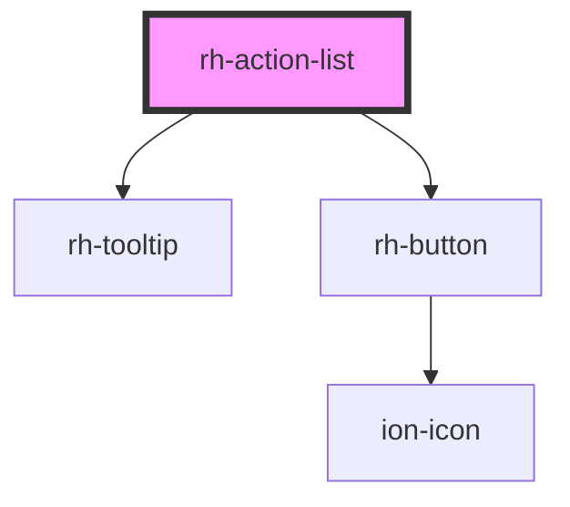

# rh-list-action

<!-- Auto Generated Below -->

## Properties

| Property       | Attribute | Description | Type                      | Default |
| -------------- | --------- | ----------- | ------------------------- | ------- |
| `fieldConfigs` | --        |             | `ActionListFieldConfig[]` | `[]`    |
| `items`        | --        |             | `any[]`                   | `[]`    |

## Events

| Event           | Description | Type               |
| --------------- | ----------- | ------------------ |
| `deleteClicked` |             | `CustomEvent<any>` |
| `editClicked`   |             | `CustomEvent<any>` |

## Dependencies

### Depends on

- [rh-tooltip](../tooltip)
- [rh-button](../buttons)

### Graph

----------------------------------------------

*Built with [StencilJS](https://stenciljs.com/)*
