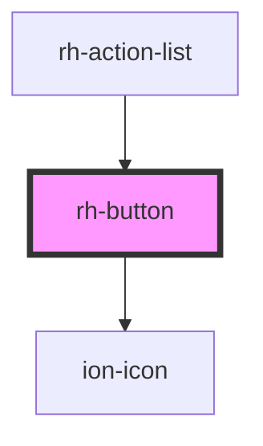

# rh-button

<!-- Auto Generated Below -->

## Properties

| Property       | Attribute        | Description | Type                                                         | Default     |
| -------------- | ---------------- | ----------- | ------------------------------------------------------------ | ----------- |
| `ariaLabel`    | `aria-label`     |             | `string`                                                     | `undefined` |
| `disabled`     | `disabled`       |             | `boolean`                                                    | `false`     |
| `ionIconColor` | `ion-icon-color` |             | `string`                                                     | `undefined` |
| `ionIconName`  | `ion-icon-name`  |             | `string`                                                     | `undefined` |
| `variant`      | `variant`        |             | `"basic" \| "filled" \| "icon" \| "stroked" \| "underlined"` | `"basic"`   |

## Events

| Event     | Description | Type               |
| --------- | ----------- | ------------------ |
| `clicked` |             | `CustomEvent<any>` |

## Dependencies

### Used by

 - [rh-action-list](../action-list)

### Depends on

- ion-icon

### Graph

----------------------------------------------

*Built with [StencilJS](https://stenciljs.com/)*
