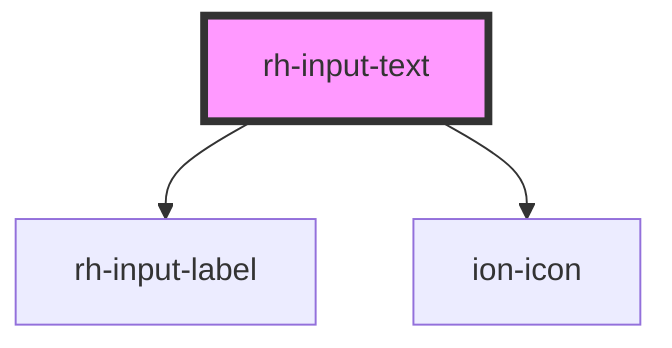

# rh-input

<!-- Auto Generated Below -->

## Properties

| Property      | Attribute     | Description | Type                   | Default     |
| ------------- | ------------- | ----------- | ---------------------- | ----------- |
| `ariaLabel`   | `aria-label`  |             | `string`               | `undefined` |
| `isInvalid`   | `is-invalid`  |             | `boolean`              | `false`     |
| `isRequired`  | `is-required` |             | `boolean`              | `false`     |
| `label`       | `label`       |             | `string`               | `undefined` |
| `maxLength`   | `max-length`  |             | `number`               | `undefined` |
| `minLength`   | `min-length`  |             | `number`               | `undefined` |
| `name`        | `name`        |             | `string`               | `undefined` |
| `placeholder` | `placeholder` |             | `string`               | `undefined` |
| `type`        | `type`        |             | `"password" \| "text"` | `"text"`    |
| `value`       | `value`       |             | `string`               | `undefined` |

## Events

| Event          | Description | Type               |
| -------------- | ----------- | ------------------ |
| `valueUpdated` |             | `CustomEvent<any>` |

## Dependencies

### Depends on

- [rh-input-label](../../shared/components/input-label)
- ion-icon

### Graph

----------------------------------------------

*Built with [StencilJS](https://stenciljs.com/)*
