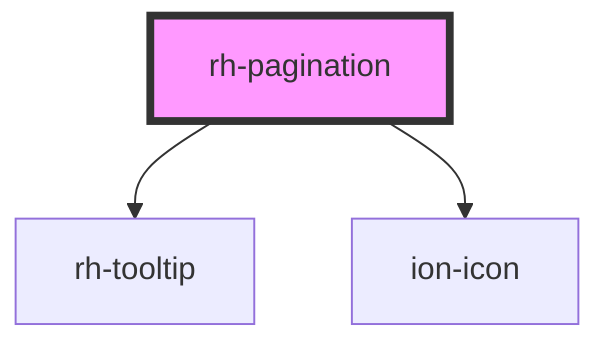

# rh-pagination

<!-- Auto Generated Below -->

## Properties

| Property            | Attribute             | Description | Type     | Default |
| ------------------- | --------------------- | ----------- | -------- | ------- |
| `initialActivePage` | `initial-active-page` |             | `number` | `1`     |
| `maxVisiblePages`   | `max-visible-pages`   |             | `number` | `10`    |
| `total`             | `total`               |             | `number` | `0`     |

## Events

| Event         | Description | Type                  |
| ------------- | ----------- | --------------------- |
| `pageClicked` |             | `CustomEvent<number>` |

## Dependencies

### Depends on

- [rh-tooltip](../tooltip)
- ion-icon

### Graph

----------------------------------------------

*Built with [StencilJS](https://stenciljs.com/)*
