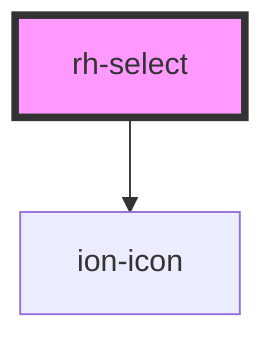

# rh-select

<!-- Auto Generated Below -->

## Properties

| Property      | Attribute     | Description | Type              | Default     |
| ------------- | ------------- | ----------- | ----------------- | ----------- |
| `label`       | `label`       |             | `string`          | `undefined` |
| `options`     | --            |             | `SelectOptions[]` | `[]`        |
| `placeholder` | `placeholder` |             | `string`          | `undefined` |

## Events

| Event                  | Description | Type                  |
| ---------------------- | ----------- | --------------------- |
| `currentSelectedValue` |             | `CustomEvent<string>` |

## Dependencies

### Depends on

- ion-icon

### Graph

----------------------------------------------

*Built with [StencilJS](https://stenciljs.com/)*
