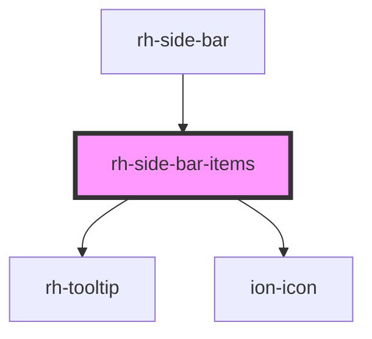

# rh-side-bar-items

<!-- Auto Generated Below -->

## Properties

| Property    | Attribute | Description | Type          | Default |
| ----------- | --------- | ----------- | ------------- | ------- |
| `menuItems` | --        |             | `MenuItems[]` | `[]`    |

## Events

| Event         | Description | Type                  |
| ------------- | ----------- | --------------------- |
| `itemClicked` |             | `CustomEvent<string>` |

## Dependencies

### Used by

 - [rh-side-bar](../..)

### Depends on

- [rh-tooltip](../../../tooltip)
- ion-icon

### Graph

----------------------------------------------

*Built with [StencilJS](https://stenciljs.com/)*
