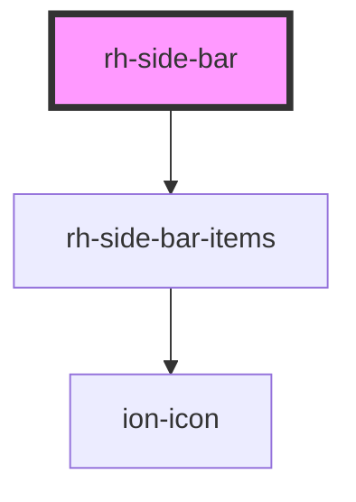

# rh-side-bar

<!-- Auto Generated Below -->

## Properties

| Property    | Attribute | Description | Type          | Default |
| ----------- | --------- | ----------- | ------------- | ------- |
| `menuItems` | --        |             | `MenuItems[]` | `[]`    |

## Dependencies

### Depends on

- [rh-side-bar-items](./components/side-bar-items)

### Graph

----------------------------------------------

*Built with [StencilJS](https://stenciljs.com/)*
