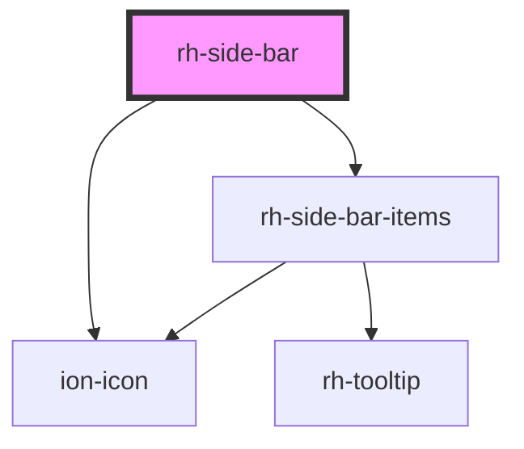

# rh-side-bar

<!-- Auto Generated Below -->

## Properties

| Property                 | Attribute              | Description | Type          | Default     |
| ------------------------ | ---------------------- | ----------- | ------------- | ----------- |
| `currentActiveIndex`     | `current-active-index` |             | `number`      | `undefined` |
| `menuItems` _(required)_ | --                     |             | `MenuItems[]` | `undefined` |

## Events

| Event         | Description | Type                   |
| ------------- | ----------- | ---------------------- |
| `isCollapsed` |             | `CustomEvent<boolean>` |

## Dependencies

### Depends on

- ion-icon
- [rh-side-bar-items](./components/side-bar-items)

### Graph

----------------------------------------------

*Built with [StencilJS](https://stenciljs.com/)*
