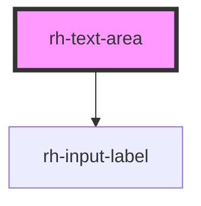

# rh-text-area

<!-- Auto Generated Below -->

## Properties

| Property      | Attribute     | Description | Type      | Default     |
| ------------- | ------------- | ----------- | --------- | ----------- |
| `ariaLabel`   | `aria-label`  |             | `string`  | `undefined` |
| `cols`        | `cols`        |             | `number`  | `20`        |
| `isInvalid`   | `is-invalid`  |             | `boolean` | `false`     |
| `isRequired`  | `is-required` |             | `boolean` | `false`     |
| `label`       | `label`       |             | `string`  | `undefined` |
| `maxLength`   | `max-length`  |             | `number`  | `undefined` |
| `minLength`   | `min-length`  |             | `number`  | `undefined` |
| `name`        | `name`        |             | `string`  | `undefined` |
| `placeholder` | `placeholder` |             | `string`  | `undefined` |
| `rows`        | `rows`        |             | `number`  | `3`         |

## Events

| Event   | Description | Type               |
| ------- | ----------- | ------------------ |
| `value` |             | `CustomEvent<any>` |

## Dependencies

### Depends on

- [rh-input-label](../../shared/components/input-label)

### Graph

----------------------------------------------

*Built with [StencilJS](https://stenciljs.com/)*
