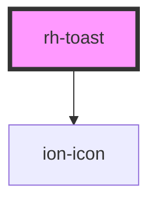

# rh-toast

<!-- Auto Generated Below -->

## Properties

| Property               | Attribute            | Description | Type                                                               | Default       |
| ---------------------- | -------------------- | ----------- | ------------------------------------------------------------------ | ------------- |
| `autoHideDuration`     | `auto-hide-duration` |             | `number`                                                           | `5000`        |
| `header`               | `header`             |             | `string`                                                           | `undefined`   |
| `isVisible`            | `is-visible`         |             | `boolean`                                                          | `false`       |
| `message` _(required)_ | `message`            |             | `string`                                                           | `undefined`   |
| `position`             | `position`           |             | `"bottom-center" \| "bottom-right" \| "top-center" \| "top-right"` | `"top-right"` |
| `type`                 | `type`               |             | `"error" \| "info" \| "success" \| "warning"`                      | `"info"`      |

## Events

| Event    | Description | Type                |
| -------- | ----------- | ------------------- |
| `closed` |             | `CustomEvent<void>` |

## Dependencies

### Depends on

- ion-icon

### Graph

----------------------------------------------

*Built with [StencilJS](https://stenciljs.com/)*
