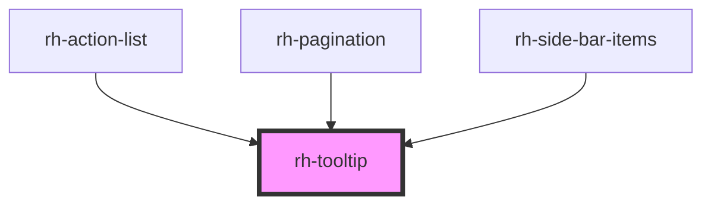

# rh-tooltip

<!-- Auto Generated Below -->

## Properties

| Property          | Attribute         | Description | Type                                     | Default     |
| ----------------- | ----------------- | ----------- | ---------------------------------------- | ----------- |
| `ariaDescribedBy` | `ariadescribedby` |             | `string`                                 | `undefined` |
| `position`        | `position`        |             | `"bottom" \| "left" \| "right" \| "top"` | `"top"`     |
| `value`           | `value`           |             | `string`                                 | `undefined` |

## Dependencies

### Used by

 - [rh-action-list](../action-list)
 - [rh-pagination](../pagination)
 - [rh-side-bar-items](../side-bar/components/side-bar-items)

### Graph

----------------------------------------------

*Built with [StencilJS](https://stenciljs.com/)*
