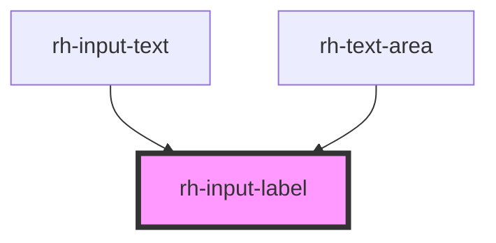

# rh-input-label

<!-- Auto Generated Below -->

## Properties

| Property     | Attribute     | Description | Type      | Default     |
| ------------ | ------------- | ----------- | --------- | ----------- |
| `isInvalid`  | `is-invalid`  |             | `boolean` | `false`     |
| `isRequired` | `is-required` |             | `boolean` | `false`     |
| `label`      | `label`       |             | `string`  | `undefined` |

## Dependencies

### Used by

 - [rh-input-text](../../../components/input-text)
 - [rh-text-area](../../../components/text-area)

### Graph

----------------------------------------------

*Built with [StencilJS](https://stenciljs.com/)*
